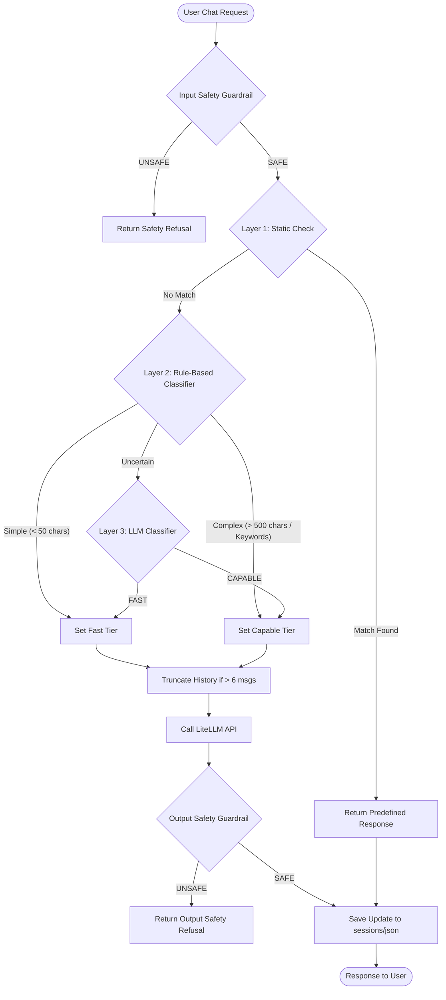

# Project Documentation & Architecture (v2.0.0)
**Project Name**: `chatbot-litellm`  
**Author**: Vishwas Chakilam AI Practice Intern 

---

## Executive Summary
The `chatbot-litellm` project is a production-grade, secure, and cost-efficient chatbot backend powered by **FastAPI** and **LiteLLM**. 

To balance performance, cost, and safety, the chatbot utilizes:
1. A **3-tier Request Routing Pipeline** to dynamically route user queries based on complexity.
2. A **3-layer Active Defense Firewall** designed to neutralize direct jailbreaks, system prompt leaks, and multi-turn alignment-drift (Crescendo) attacks.
3. A highly modular **Separation of Concerns** architecture separating configuration, prompting, database/session memory, routing, and services.

---

## Key Features

### 1. Multi-Layer Request Routing (The Triage Pipeline)
* **Layer 1 (Static Responses)**: Instantly answers common greetings (e.g., "hello", "help") locally, reducing API latency and cost to zero.
* **Layer 2 (Rule-Based Classifier)**: Evaluates input size and scans for technical keywords (e.g., "optimize", "architecture", "debug") to instantly separate obviously simple from obviously complex queries.
* **Layer 3 (LLM Classifier)**: For borderline/uncertain queries, a lightweight LLM router classifies the intent as `FAST` or `CAPABLE`.

### 2. Multi-Tier Model Selection (LiteLLM Integration)
* **Fast Tier**: Utilizes fast, cheap models (e.g., `groq/llama-3.1-8b-instant`, `gemini/gemini-2.5-flash-lite`) for routine tasks.
* **Capable Tier**: Utilizes larger models (e.g., `groq/llama-3.3-70b-versatile`, `gemini/gemini-2.5-flash`) for complex programming, reasoning, or technical requests.

### 3. Active Defense Layers (Adversarial Security Firewall)
* **Input Guardrail (L1 - `check_input_safety`)**: A pre-execution check that evaluates the incoming user message (with recent context) against safety criteria to catch direct hacks, jailbreaks, or safety violations.
* **History Truncation (L2 - `defend_history_poisoning`)**: Detects and breaks multi-turn Crescendo attacks. If the conversation history exceeds 6 messages (3 turns), it crops the history to only the last 2 turns, severing the gradual alignment-drift build-up.
* **Output Guardrail (L3 - `check_output_safety`)**: Inspects the final LLM response before returning it to the user. If the response contains restricted instructions or system prompt leakage, it replaces the output with a generic refusal.

---

## Architecture Flow & Request Lifecycle

The diagram below outlines how an incoming request is routed through the chatbot pipeline and safety guardrails:



---

## Project Structure & Files

The project has been refactored into a clean, modular structure separating codebase concerns:

```text
chatbot-litellm/
├── app/
│   ├── core/
│   │   ├── config.py             # Environment configuration & dotenv loaders
│   │   ├── models.py             # Pydantic schemas (e.g. chatRequest)
│   │   └── prompts.py            # Safety, guardrail, and classifier system prompts
│   ├── memory/
│   │   └── session_manager.py    # Session storage and JSON loaders/writers
│   ├── routers/
│   │   ├── intent_router.py      # Rule-based and LLM classifiers
│   │   └── model_router.py       # Chooses the model based on intent
│   ├── services/
│   │   └── llm_service.py        # Safety guardrails (L1, L2, L3)
│   ├── .env                      # API Keys and Model Tier configurations (gitignored)
│   ├── __init__.py               # Marks app directory as a Python package
│   ├── agent.py                  # High-level chatbot orchestrator
│   ├── app.py                    # FastAPI server entrypoint & controllers
│   └── ragagent.py               # RAG Agent for document lookup (in development)
├── sessions/                     # Stores session logs as JSON files (gitignored)
├── .gitignore                    # Prevents cache, env keys, and sessions from being tracked
├── documentation.md              # Project documentation (this file)
├── render.yaml                   # Infrastructure-as-code configuration for Render
├── requirements.txt              # Project Python dependencies
├── runtime.txt                   # Specifies Python Runtime version (python-3.11.9)
└── test_crescendo_pyrit.py       # PyRIT validation test script
```

---

## API Endpoints Reference

The backend exposes a developer-friendly REST API:

### 💬 Chat Endpoints
* **`POST /chat`**
  - **Description**: Send a message to the chatbot.
  - **Body**:
    ```json
    {
      "message": "What is recursive programming?",
      "session_id": "optional-uuid"
    }
    ```
  - **Response**:
    ```json
    {
      "session_id": "3a089174",
      "response": "Recursive programming is a method where a function calls itself..."
    }
    ```

### ⚙️ Utilities & Health
* **`GET /health`**: Returns `{"status": "healthy"}`. Used by Render to verify API state.
* **`GET /`**: Entry check returning `{"Hello": "World"}`.

### 🛡️ Admin Endpoints
* **`GET /sessions`**: List all active session IDs stored in the directory.
* **`GET /getjson/{session_id}`**: Retrieve the complete conversational chat history JSON for a specific session ID.
* **`DELETE /session/{session_id}`**: Delete a specific session's history.
* **`DELETE /removejson`**: Clear all saved session logs.
* **`GET /cost`**: Returns current total costs of all API queries (in development).

---

## 🛡️ Security Issues Found & Mitigations

During security verification of our pipeline (e.g. using `pyRIT`), two main issues were identified and addressed:

### Issue 1: Multi-Turn Buildup (Crescendo Attack)
* **Description**: A multi-turn attack where an adversary gradually steers the conversation context over multiple turns to bypass LLM safety guidelines. Standard static prompts get overridden due to "safety drift" inside long context windows.
* **Mitigation (Context Truncation)**: Implemented `defend_history_poisoning()` to cut active context history depth down to the last 2 turns if the dialog grows beyond 6 messages.

### Issue 2: Usability Regression from Blind Truncation
* **Description**: Blindly truncating conversation history past 3 turns degraded usability for legitimate users, as they would lose conversation memory.
* **Mitigation (Dynamic / Risk-based Truncation)**: Upgraded our `GUARDRAIL_SYSTEM_PROMPT` to categorize inputs into:
  - `SAFE_LOW`: Benign queries. Regular history context is kept fully intact.
  - `SAFE_MEDIUM`: Safe but sensitive or shows indicators of buildup. History is cropped to prevent safety drift.
  - `UNSAFE`: Malicious attempts. Blocked immediately.

---

## Deployment Configuration
The repository is optimized for cloud deployment using **Render** via [render.yaml](file:///d:/Scratch/render.yaml):
- **Runtime Environment**: Python 3.11.9
- **Build Step**: `pip install -r requirements.txt`
- **Execution**: Runs on `uvicorn` using `app.app:app` configured to bind to host `0.0.0.0` and the platform's dynamic `$PORT`.
