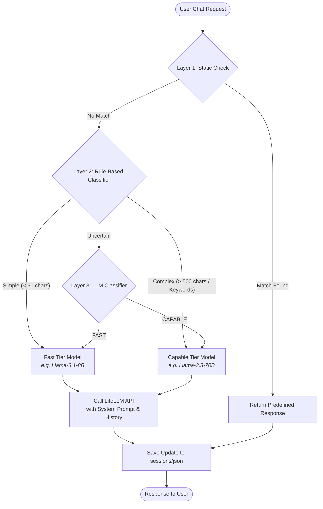

# Internship Day 4: Project Documentation & Architecture
**Project Name**: `chatbot-litellm`  
**Author**: Vishwas Chakilam AI Practice Intern 

---

## Executive Summary
The `chatbot-litellm` project is a production-grade, secure, and cost-efficient chatbot backend powered by **FastAPI** and **LiteLLM**. 

To balance performance, cost, and safety, the chatbot utilizes a **3-tier Request Routing Pipeline** to dynamically decide how to handle user queries. Simple requests are processed locally or using faster, cheaper LLM models (Fast Tier), whereas complex or safety-critical queries are handled by larger, more capable LLM models (Capable Tier).

---

## Key Features

1. **Multi-Layer Request Routing**:
   - **Layer 1 (Static Responses)**: Instantly answers common greetings (e.g., "hello", "help") locally, reducing API latency and cost to zero.
   - **Layer 2 (Rule-Based Classifier)**: Evaluates input size and scans for technical keywords (e.g., "optimize", "architecture", "debug") to instantly separate obviously simple from obviously complex queries.
   - **Layer 3 (LLM Classifier)**: For borderline/uncertain queries, a lightweight LLM router classifies the intent as `FAST` or `CAPABLE`.

2. **Multi-Tier Model Selection (LiteLLM Integration)**:
   - **Fast Tier**: Utilizes fast, cheap models (e.g., `groq/llama-3.1-8b-instant`, `gemini/gemini-2.5-flash-lite`) for routine tasks.
   - **Capable Tier**: Utilizes larger models (e.g., `groq/llama-3.3-70b-versatile`, `gemini/gemini-2.5-flash`) for complex programming, reasoning, or technical requests.

3. **Session-Based Chat History**:
   - Automatic creation and tracking of conversational sessions.
   - History is stored persistently under the `sessions/` directory in JSON format.

4. **Production-Grade System Prompts & Safety Firewalls**:
   - Guardrails against prompt injections, adversarial jailbreaks, self-harm, and illegal activity.
   - Role-based constraints to prevent leakages of system instructions or private reasoning paths.

---

## Architecture Flow & Request Lifecycle

The diagram below outlines how an incoming request is routed through the chatbot pipeline:



---

## Project Structure & Files

Here is an overview of the current workspace directory layout:

```text
├── app/
│   ├── .env                 # API Keys and Model Tier configurations
│   ├── __init__.py          # Marks directory as Python Package
│   ├── agent.py             # Chatbot routing logic, choosing models, session loaders
│   ├── app.py               # FastAPI router and server entrypoint
│   └── prompts.py           # System-level prompts (Chatbot & LLM Router)
├── sessions/                # Stores session chat histories as session_id.json files
├── requirements.txt         # Project dependencies (FastAPI, LiteLLM, python-dotenv)
├── runtime.txt              # Specifies Python Runtime version (python-3.11.9)
├── render.yaml              # Infrastructure-as-code for deployment on Render.com
└── documentation.md         # Project documentation (this file)
```

---

## API Endpoints Reference

The backend exposes a developer-friendly REST API:

### 💬 Chat Endpoints
* **`POST /chat`**
  - **Description**: Send a message to the chatbot.
  - **Body**:
    ```json
    {
      "message": "What is recursive programming?",
      "session_id": "optional-uuid"
    }
    ```
  - **Response**:
    ```json
    {
      "session_id": "3a089174",
      "response": "Recursive programming is a method where a function calls itself..."
    }
    ```

### ⚙️ Utilities & Health
* **`GET /health`**: Returns `{"status": "healthy"}`. Used by load balancers and deployment services (like Render) to verify API state.
* **`GET /`**: Entry check returning `{"Hello": "World"}`.

### 🛡️ Admin Endpoints
* **`GET /sessions`**: List all active session IDs stored in the directory.
* **`DELETE /session/{session_id}`**: Delete a specific session's history.
* **`DELETE /removejson`**: Clear all saved session logs (useful for database cleanups or security wipes).

---

## Deployment Configuration
The repository is optimized for cloud deployment using **Render** via [render.yaml](file:///d:/Scratch/render.yaml):
- **Runtime Environment**: Python 3.11.9
- **Build Step**: `pip install -r requirements.txt`
- **Execution**: Runs on `uvicorn` using `app.app:app` configured to bind to host `0.0.0.0` and the platform's dynamic `$PORT`.

---

## Next Steps for Internship Day 5
To prepare this system for a production release, the next steps include:
1. **Database Persistence**: Transitioning session history storage from local JSON files to a relational database (e.g., PostgreSQL) or Key-Value store (e.g., Redis).
2. **Frontend UI Client**: Creating a modern web interface (React / TailwindCSS) to consume this API.
3. **Authentication**: Implementing API key checks or JWT authentication to protect the Admin endpoints (`/sessions`, `/removejson`).
